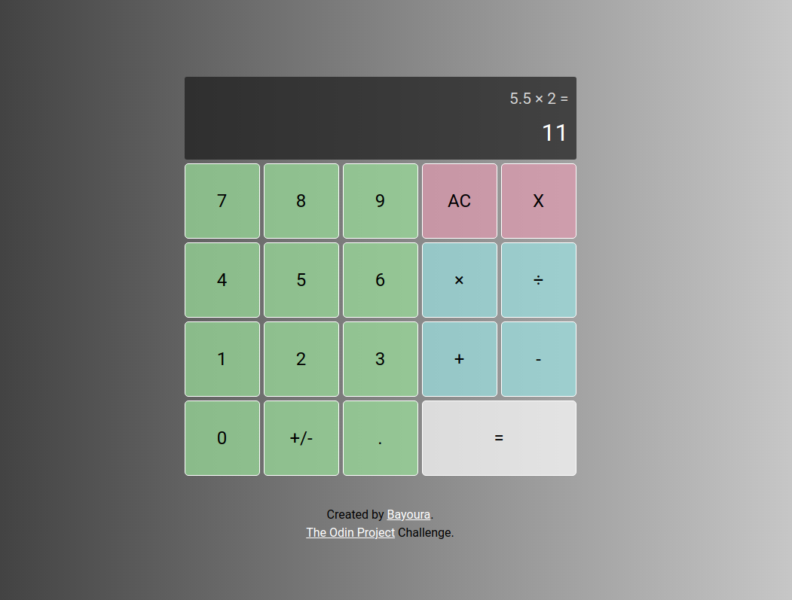

# calculator

## Links

- [View Code](https://github.com/Bayoura/calculator)
- [Live Demo](https://bayoura.github.io/calculator/)

## Built with

- HTML
- CSS
- Grid
- Flexbox
- Vanilla JavaScript

## What I learned

- I decided to take on the extra challenge and add keyboard support, which was easier than I first thought. Initially I planned on using the respective event key-codes for each key. This thought process was a bit more complicated than it needed to be, and in the end I just used the `key` property (event.key). This made it really simple. The `key` focusses on the value of the key (for example the number 1), while the key-codes focus on the keys themselves (each key on the keyboard has an individual key-code even if their value is the same). 
- I learned more about using hsl colour codes.
- Since this is the second project in which I am using CSS grid, I also got more comfortable with that.
- I learned more about variables and constantly updating their values in order to use them in a dynamic way (in this case the operand and operator values had to be updated according to the user's input).
- I also got more comfortable at declaring and calling functions, passing arguments etc.

## Author

- [codepen](https://codepen.io/bayoura)
- [GitHub](https://github.com/Bayoura)
- [Frontend Mentor](https://www.frontendmentor.io/profile/Bayoura)

